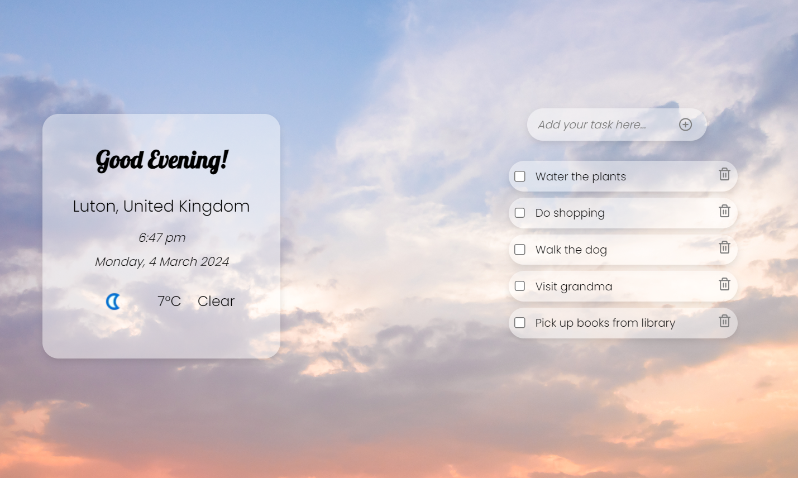

# Weather and Daily Task App

## Overview

The Weather and Tasks App is a React-based application that enhances daily productivity by providing weather updates based on the user's location along with a simple to-do list to manage daily tasks.

### Features

- **Geolocation**: Automatically fetches the user's current location to provide localised weather data.
- **Weather Data**: Displays the weather information including temperature, conditions, and more, using the Weather API.
- **Dynamic Greeting**: Offers a greeting message that changes based on the time of the day.
- **Task Management**: Allows users to add, mark as complete, and delete daily tasks.

   

### Technologies

- React.js
- SCSS with BEM notation
- WeatherAPI
- Vite
- Browser Geolocation API

## Setup and Installation

- Clone the repository.
- Install dependencies: npm install.
- Start the application: npm run dev.

Alternatively, view the live version deployed on GitHub Pages at [View Live Weather App](https://jm-go.github.io/weather/).

## Contact

For any additional questions or comments, feel free to reach out to me directly through the contact information provided on the website.
